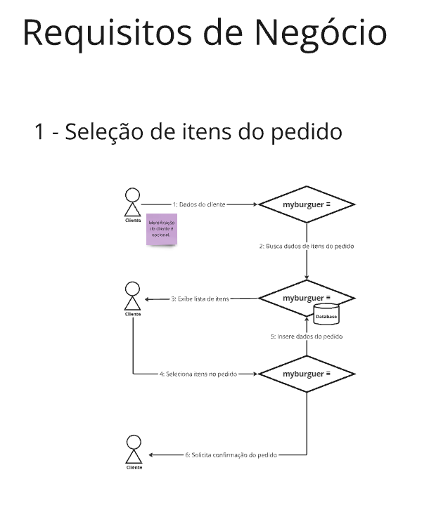
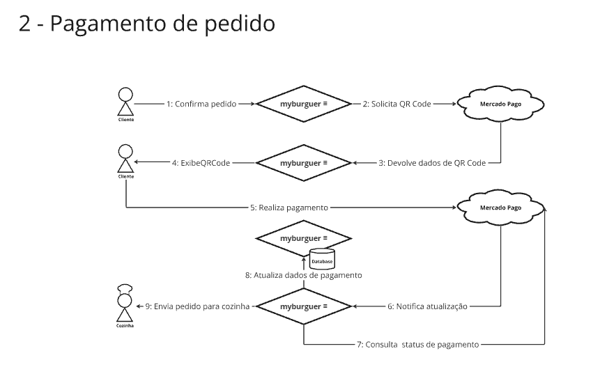
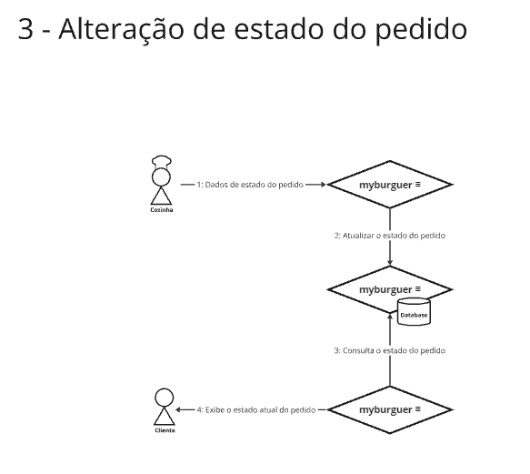
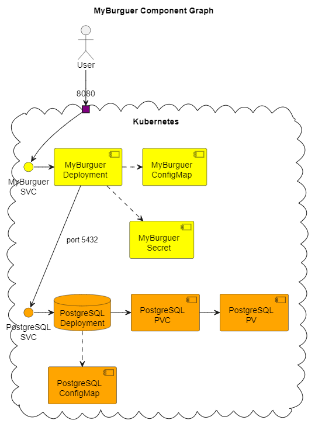

[![CI [MyBurguer ≡]](https://github.com/FIAP-SOAT7-2024-GP-Kotlin/myburgercontrol-clean-arch/actions/workflows/main.yml/badge.svg)](https://github.com/FIAP-SOAT7-2024-GP-Kotlin/myburgercontrol-clean-arch/actions/workflows/main.yml)

# My Burguer Control - 7SOAT
___

## `myburgercontrol-clean-arch`

Este projeto é um monolito para o curso de Software Architeture da turma 7SOAT na instituição FIAP no ano de 2024.
___

## Índice

1. [DDD](#ddd)
2. [Componentes](#componentes)
3. [Frameworks](#frameworks)
4. [Inicialização da Aplicação](#inicialização-da-aplicação)
5. [Jornadas](#jornadas)
   - Jornada de Autenticação
   - Jornada de Cliente
   - Jornada de Pedido
   - Jornada de Pagamento
   - Administrativo
6. [Liquibase](#liquibase)
   - Gerando um XML do Liquibase Novo
7. [Infraestrutura de Cloud](#infraestrutura-de-cloud)
8. [Videos demonstrativo](#videos-demonstrando-a-aplicação)
9. [Desenhos de Arquitetura](#arquitetura)
   - Arquitetura de negocio
   - Arquiteutra de infra
10. [Contatos](#contatos)

___
## DDD

Acesse [aqui](https://miro.com/app/board/uXjVKWJ-8T0=/?share_link_id=109211348615) o miro com:

- levantamento de requisitos
- dicionário de linguagem ubíqua
- event storming
___
## Componentes

Esta aplicação tem basicamente 3 componentes:

- Banco de dados PostgresSQL versão 16
- Aplicação `myburgercontrol-monolith`
- Wiremock
___
## Frameworks

Este projeto utiliza as seguintes tecnologias e linguagens:

- Kotlin JVM
- JVM OpenJDK Temurin 21 LTS
- Springboot 3
- JaCoCo
- Liquibase
___
## Inicialização da aplicação

O ambiente utiliza Docker Compose para iniciar os componentes da aplicação. Todas as configurações das variáveis de
ambiente estão especificadas na seção `environment` do arquivo `docker-compose.yml`.

### Configuração de ambiente

Após clonar o repositório, execute o seguinte comando :

```sh
docker compose up
```

### Acessando a aplicação

Neste momento a interface do Swagger estará disponível no endereço abaixo:

> [http://localhost:8080/swagger-ui.html](http://localhost:8080/api/v1/swagger-ui/index.html#/)

### Jornadas

Para facilitar o uso da aplicação, utilizamos as jornadas com o conjunto de endereços restritos as funcionalidades
desejada na ordem de execução.

#### Jornada de autenticação

- **[POST]** | */users* | Utilize esta rota para criar um novo usuário.
- **[GET]** | */users* Utilize esta rota para encontrar um usuário utilizando o cpf.
- **[POST]** | */auth* | Utilize esta rota para autenticar um usuário já criado.
- **[POST]** | */users/{id}* | Utilize esta rota para encontrar um usuário utilizando o identificador na base de dados.

#### Jornada de Cliente

- **[POST]** | */customers* | Utilize esta rota para criar um novo cliente.
- **[GET]** | */customers* | Utilize esta rota para encontrar um cliente pelo CPF.

#### Jornada de Pedido

- **[GET]** | */products* | Utilize esta rota para buscar todos os produtos cadastrados.
- **[GET]** | */products/type* | Utilize esta rota para buscar todos os produtos cadastrados por categoria.
- **[POST]** | */orders* | Utilize esta rota para criar um pedido.
- **[GET]** | */orders/queue* | Utilize esta rota para encontrar a lista do(s) novo(s) pedido(s).
- **[GET]** | */orders* | Utilize esta rota para encontrar o(s) pedido(s) por cpf de cliente.
- **[POST]** | */orders/received* | Utilize esta rota para alterar o estado pedido para RECEBIDO.
- **[POST]** | */orders/in-progress* | Utilize esta rota para alterar o estado pedido para EM PREPARAÇÃO.
- **[POST]** | */orders/ready* | Utilize esta rota para alterar o estado pedido para PRONTO.
- **[POST]** | */orders/finished* | Utilize esta rota para alterar o estado pedido para FINALIZADO.

#### Jornada de Pagamento
- **[POST]** | */payment* | Utilize esta rota iniciar uma solicitação de QRCode para pagamento.


#### Adminstrativo

- **[POST]** | */products* | Utilize esta rota para cadastrar um novo produto.
- **[GET]** | */products/{id}* | Utilize esta rota para encontrar um produto utilizando o identificador na base de
  dados.
- **[GET]** | */customer/{id}* | Utilize esta rota para encontrar um cliente utilizando o identificador na base de
  dados.
___
## Liquibase

O Liquibase é um componente de gerenciamento de versões de alterações de banco de dados. Neste projeto, estamos
utilizando o padrão XML do Liquibase, localizado na pasta `src/main/resources/db/changelog`. Todos os arquivos XML no
diretório `src/main/resources/db/changelog/changes` serão executados.

#### Gerando um XML do Liquibase novo

Para gerar um XML novo é recomendado subir o banco e a aplicação ao menos uma vez **ANTES** de implementar novas
entidades.
Depois disso, com o apenas o banco de dados em execução, basta rodar o comando:

```sh
gradle diffChangelog
```

Esse comando vai gerar no caminho `build/tmp/` um arquivo `diff-changelog.xml`, contendo as *DIFERENÇAS* entre o banco
de
dados em execução e a implementação do JPA que consta no código fonte.

> **Nota:** É fundamental olhar o arquivo gerado e validar se o mesmo está de acordo. Essa geração de arquivo do
> liquibase
> costuma não gerar nome de PKs, por exemplo.

___
## Infraestrutura de Cloud

Nós optamos por usar a DigitalOcean. Sendo assim precismos subir um cluester Kubernetes (k8s) na cloud da DigitalOcean. Para tal vamos usar, nesse momento o `doctl` [CLI fornecido pela Digital Ocean](https://docs.digitalocean.com/reference/doctl/how-to/install/).

Os scripts em `scripts/k8s-cluster` contém 2 shell scripts:
- `create-cluster.sh` - que cria um cluster na Digital Ocean no projeto Myburger
- `drop-cluster.sh` - que apaga o cluster. **Esse Script apaga TODOS OS RECURSOS associados ao cluster**

___
## Videos demonstrando a aplicação
> Video demonstrando a arquitetura desenvolvida para o projeto [aqui](https://www.youtube.com/watch?v=DzmUBK7f0Ec&feature=youtu.be)

> Video demonstrando a integração com Mercado Pago [aqui](https://youtu.be/89De3PFDg_k)
___

## Arquitetura

### Arquitetura de negocio




### Arquitetura de infra

___
## Contatos

### Grupo composto pelos os alunos

| Nome                         | RM       |
|------------------------------|----------|
| André Luis dos Santos        | RM355299 |
| Fernando Florencio           | RM355268 |
| Luiz Fernando Calazans       | RM354794 |
| José Carlos dos Santos Rocha | RM355769 |
| Rafael José Peres Correia    | RM355308 |
